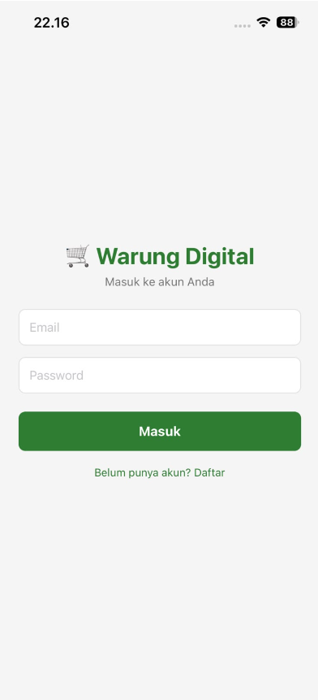
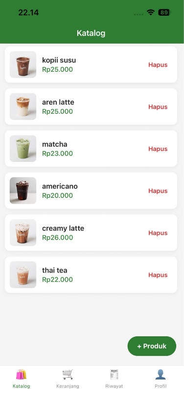
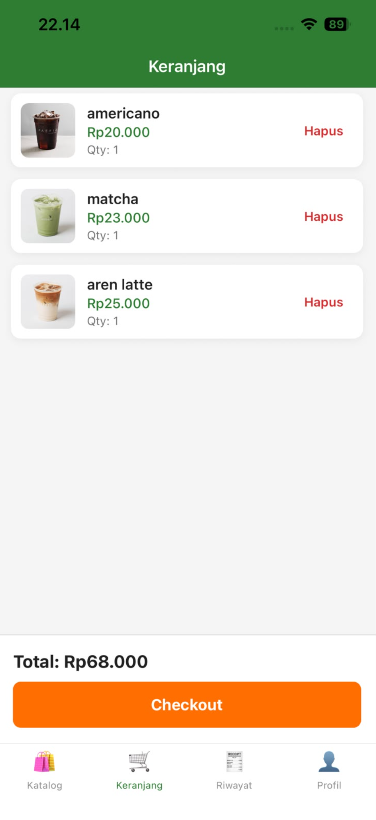

# Warung Digital — Domain: Warung Digital (E-Commerce Sederhana)


> Aplikasi mobile Warung Digital untuk mengelola katalog produk, keranjang belanja, dan riwayat transaksi secara sederhana. Cocok untuk pemilik warung kecil yang ingin mendigitalisasi pencatatan penjualan tanpa perlu sistem POS yang rumit.

---

## 📸 Screenshots

| Login Screen | Katalog Screen | Keranjang Screen |
|:---:|:---:|:---:|
|  |  |  |

---

## ✨ Fitur Utama

- [x] Login/Register dengan validasi form
- [x] Daftar produk dengan FlatList (Katalog)
- [x] Keranjang belanja dengan tambah/hapus item
- [x] Riwayat transaksi tersimpan
- [x] Tambah produk baru dengan foto via expo-image-picker
- [x] Data persisten dengan AsyncStorage
- [x] Bottom Tab Navigation (Katalog / Keranjang / Riwayat / Profil)

---

## 🛠️ Tech Stack

| Layer | Teknologi |
|-------|-----------|
| Framework | React Native + Expo |
| Navigation | React Navigation v6 (Stack + Bottom Tab) |
| Storage | @react-native-async-storage/async-storage |
| Device | expo-image-picker |
| Build | EAS Build (Expo Application Services) |

---

## 🚀 Cara Menjalankan

```bash
git clone https://github.com/Vnderbilts/warung-digital-uas.git
cd warung-digital-uas
npm install
npx expo start
```

Scan QR Code dengan Expo Go di HP.

---

## 📦 Download APK

[Download APK terbaru](https://expo.dev/accounts/yonalidya/projects/warung-digital/builds/0056c773-64da-4d05-91f8-2e74ff279c2e)

---

## 👤 Developer

**Diki Ferdianto** | 243303621208 | Kelas 4 Pagi A
Universitas Prima Indonesia — Prodi Sistem Informasi
Mata Kuliah: Pemrograman Mobile (TI-MOBILE-01)
